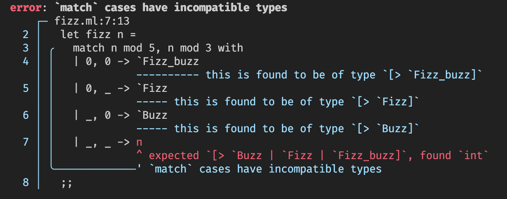

# Grace 💅

> A fancy diagnostics library that allows your compilers to exit with _grace_

Grace is an OCaml 🐪 library that includes a series of interfaces for building, reporting, and rendering beautiful compiler errors 📜.

<div align="center">
    
</div>

We're still actively working on Grace to support more use cases and improving the quality of the rendering engine. Contributions are very welcome!

## Features

- 📐 Inline and multi-line error messages with associated priorities
- 📂 Multi-file errors
- ⚙️ Configurable rendering (styling and character set)
- 💰 Rich and compact error rendering
- 🌈 Colored messages (thanks to `Fmt`'s `style`) for ANSI terminals
- 💪 Written in OCaml

### Planned Features

- [ ] Unicode support
- [ ] LSP integration
- [ ] Error codes
- [ ] Accessibility features (improved color options, narratable renderers)
- [ ] HTML renderer

## Installation

This library is available on `opam`. To install
```sh
opam install grace
```

Users of `dune` can then use this library by adding the appropriate libraries:

```
(library
 ...
 (libraries grace grace.rendering ...))
```

## Usage

```ocaml
open! Grace

(* Grace provides a [Source] API for in-memory representations of sources/files. *)
let fizz : Source.t =
  `String
    { name = Some "fizz.ml"
    ; content =
        {|
let fizz n =
  match n mod 5, n mod 3 with
  | 0, 0 -> `Fizz_buzz
  | 0, _ -> `Fizz
  | _, 0 -> `Buzz
  | _, _ -> n
;;
|}
    }
;;

(* Normally locations (ranges) would be taken from AST nodes, but for sake of
   this example we construct them directly. *)
let diagnostic =
  let range start stop =
    Range.create ~source:fizz (Byte_index.of_int start) (Byte_index.of_int stop)
  in
  Diagnostic.(
    createf
      ~labels:
        Label.
          [ primaryf
              ~range:(range 116 117)
              "expected `[> `Buzz | `Fizz | `Fizz_buzz]`, found `int`"
          ; secondaryf ~range:(range 17 117) "`match` cases have incompatible types"
          ; secondaryf ~range:(range 57 67) "this is found to be of type `[> `Fizz_buzz]`"
          ; secondaryf ~range:(range 80 85) "this is found to be of type `[> `Fizz]`"
          ; secondaryf ~range:(range 98 103) "this is found to be of type `[> `Buzz]`"
          ]
      Error
      "`match` cases have incompatible types")
;;

let () =
  Format.printf
    "%a@."
    Grace_rendering.(Ansi.pp_diagnostic ~config:Config.default)
    diagnostic
;;
```

## Authors and Acknowledgement

Authors:

- Alistair O'Brien (`@johnyob`)

`grace` was heavily inspired by all the work on compiler diagnostics in the Rust ecosystem:

- `@brendanzab` for the `codespan` crate which _heavily_ influenced the design of `grace`'s rendering engine.
- `ariadne` (`@zesterer`) for pushing the boundary on diagnostic rendering.
- `rustc` and `@estebank`'s work on the state-of-the-art work on compiler diagnostics

## License

This code is free, under the MIT license.
