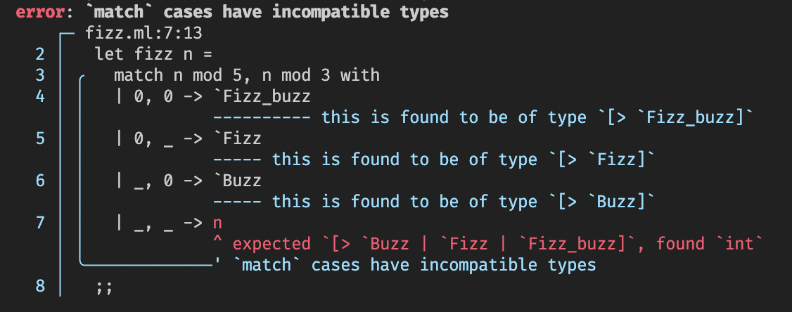

# Grace 💅
> A fancy diagnostics library that allows your compilers to exit with *grace*

Grace is an OCaml 🐪 library that includes a series of interfaces for building, reporting, and rendering beautiful compiler errors 📜. 

<div align="center">
    
</div>

We're still actively working on Grace to support more use cases and improving the quality of the rendering engine. Contributions are very welcome!

## Features

- 📐 Inline and multiline error messages with associated priorities 
- ⚙️ Configurable rendering (styling and character set)
- 💰 Rich and Compact error rendering
- 🌈 Colored messages (thanks to `Fmt`'s `style`) for ANSI terminals
- 💪 Written in OCaml

### Planned Features

- [ ] Error codes
- [ ] LSP integration
- [ ] Multi-file errors
- [ ] Accessibility features (improves color options, screen reader/braille support)
- [ ] Improved layout rendering for labels

## Installation

This library has not yet been released to `opam`. To install, first

```sh
opam pin add --yes https://gitlab.com/alistair.obrien/grace.git
opam install grace
```
Users of `dune` can then use this library by adding the appropriate libraries:
```
(library
 ...
 (libraries grace grace.rendering grace.lsp ...))
```

## Usage

```ocaml

let source =
  {|
let fizz n = 
  match n mod 5, n mod 3 with
  | 0, 0 -> `Fizz_buzz
  | 0, _ -> `Fizz
  | _, 0 -> `Buzz
  | _, _ -> n
;;
|}
;;

(* Grace provides a Files API for in-memory representations of 
   files. *)
let files = Files.create ()
let fizz = Files.add files "fizz.ml" source

(* Normally locations (ranges) would be taken from AST nodes, but for 
   sake of this example we construct them directly. *)
let diagnostic : Diagnostic.t =
  let range start stop =
    Range.create (Byte_index.create start) (Byte_index.create stop)
  in
  Diagnostic.
    { severity = Error
    ; message = (fun ppf -> Fmt.pf ppf "`match` cases have incompatible types")
    ; labels =
        [ Label.primary ~id:fizz ~range:(range 116 117) (fun ppf ->
              Fmt.pf ppf "expected `[> `Buzz | `Fizz | `Fizz_buzz]`, found `int`")
        ; Label.secondary ~id:fizz ~range:(range 17 117) (fun ppf ->
              Fmt.pf ppf "`match` cases have incompatible types")
        ; Label.secondary ~id:fizz ~range:(range 57 67) (fun ppf ->
              Fmt.pf ppf "this is found to be of type `[> `Fizz_buzz]`")
        ; Label.secondary ~id:fizz ~range:(range 80 85) (fun ppf ->
              Fmt.pf ppf "this is found to be of type `[> `Fizz]`")
        ; Label.secondary ~id:fizz ~range:(range 98 103) (fun ppf ->
              Fmt.pf ppf "this is found to be of type `[> `Buzz]`")
        ]
    ; notes = []
    }
;;

(* We now render the rich version of the diagnostic to [stdout] using the 
   default config (colors + unicode) 
*)
let () =
  Fmt_doc.render
    Fmt.stdout
    Grace_rendering.(ppd_rich ~config:Config.default ~files diagnostic)
;;
```


## Authors and Acknowledgement

Authors:
- Alistair O'Brien (`@alistair.obrien`) (`@johnyob`)

`grace` was heavily inspired by all the work on compiler diagnostics in the Rust ecosystem:
 - `@brendanzab` for the `codespan` crate which *heavily* influenced the design of `grace`'s rendering engine.
 - `ariadne` (`@zesterer`) for pushing the boundary on diagnostic rendering.  
 - `rustc` and `@estebank`'s work on the state-of-the-art work on compiler diagnostics

## License
This code is free, under the MIT license.
